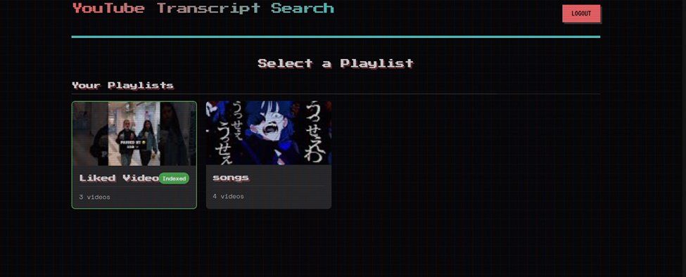
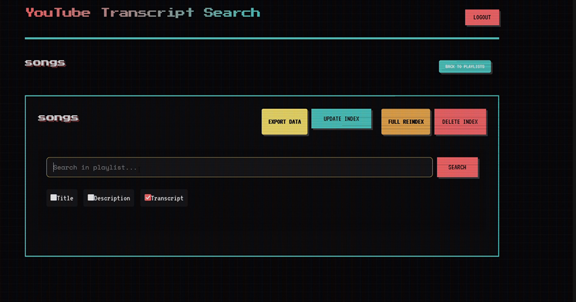
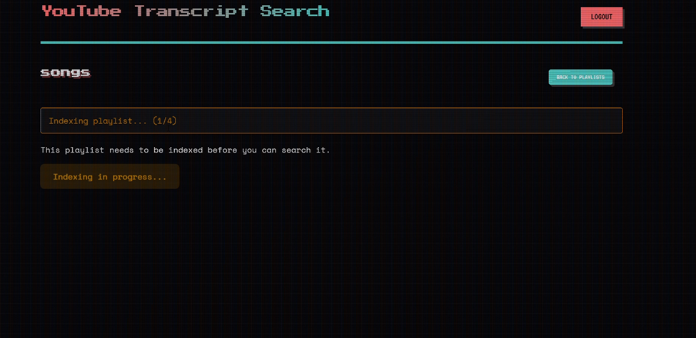
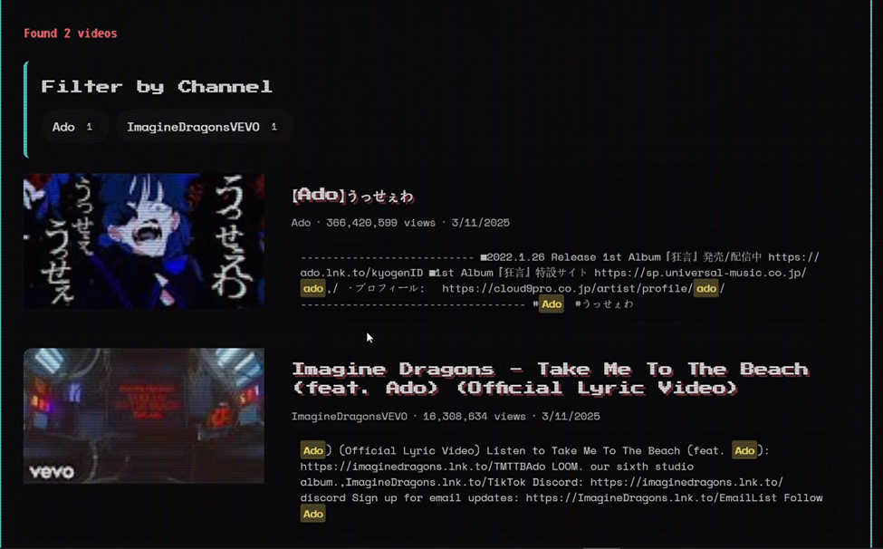

# YouTube Transcript Search (YTS)

A friend needed a tool that let him, search videos from his personal playlists, based on the transcript information. A platform called filmot does this, but is not personalized for private playlists, I added that functionality, with a bunch of others.


## Tech Stack
- **Frontend**: React.js
- **Backend**: Flask (Python)
- **Search Engine**: Elasticsearch 7.x
- **Authentication**: Google OAuth2

## Prerequisites
- Python 3.8+
- Node.js 14+
- Elasticsearch 7.x
- Google Developer Account with YouTube API access

## Quick Start

### 1. Environment Setup
Create required `.env` files:

```bash
# backend/.env
YOUTUBE_API_KEY=your_youtube_api_key
GOOGLE_CLIENT_ID=your_google_client_id
GOOGLE_CLIENT_SECRET=your_google_client_secret
```

```bash
# frontend/.env
REACT_APP_GOOGLE_CLIENT_ID=your_google_client_id
```

### 2. Backend Setup
```bash
cd backend
python -m venv venv
.\venv\Scripts\activate
pip install -r requirements.txt
python run.py
```

### 3. Frontend Setup
```bash
cd frontend
npm install
npm start
```

### 4. Elasticsearch
- Start Elasticsearch service
- Verify at `http://localhost:9200`


## API Endpoints

| Endpoint | Method | Description |
|----------|--------|-------------|
| `/api/auth/login` | POST | Authentication |
| `/api/playlists` | GET | List playlists |
| `/api/playlists/index` | POST | Index playlists |
| `/api/search` | GET | Search videos |
| `/api/export` | GET | Export results |


- Frontend: `http://localhost:3000`
- Backend: `http://localhost:5000`
- Elasticsearch: `http://localhost:9200`


## Images







***Have to work on deployment, cannot seem to find a cost free way to deploy elasticsearch properly.***
